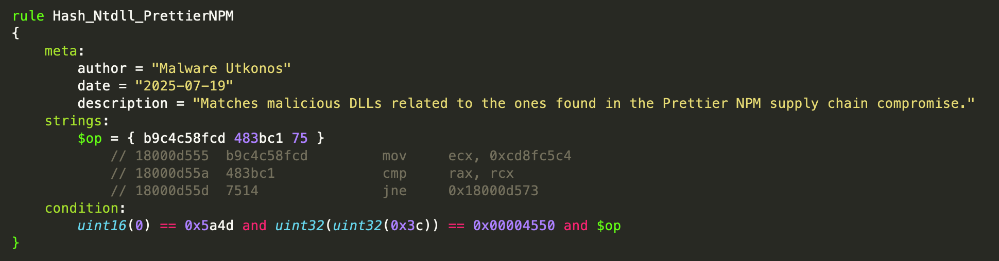
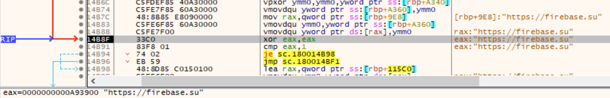

# Supply Chain Trojan `sc_trojan_jwjf`

On July 18th, Socket published [research](https://socket.dev/blog/npm-phishing-campaign-leads-to-prettier-tooling-packages-compromise) on a phishing campaign which led to a compromise of a set of NPM packages which were related to the [Prettier](https://www.npmjs.com/package/prettier) code formatting tool. The DLL trojan found in this attack as well other samples as investigated below is designated as `sc_trojan_jwjf`.

*Update:* Twitter user [cyb3rjerry](https://x.com/cyb3rjerry) located the name of the malware, `scavenger`, according to parts of the PDB path found in this sample:

```text
c3536b736c26cd5464c6f53ce8343d3fe540eb699abd05f496dcd3b8b47c5134
```

You can read all about it in the excellent blog [here](https://c-b.io/2025-07-20+-+Install+Linters%2C+Get+Malware+-+DevSecOps+Speedrun+Edition).

## Package got-fetch

In addition to this part of the campaign, two versions of the got-fetch NPM package were compromised by the same adversary:

| Package Name | Version |
|----------|----------|
| [got-fetch](https://secure.software/npm/packages/got-fetch/5.1.11)   | 5.1.11   |
| [got-fetch](https://secure.software/npm/packages/got-fetch)   | 5.1.12   |

### Package 5.1.11

```text
Package: 3ca29a4036491bfb1cce9ddd2f355bb3cec80cc0dcd2915c456c25ca103cd273

Javascript: fc1420c8e74cc15292e9d443b1aa04f697ecafc4e0b1c5d4794594717232c3b2
Filename: install.cjs

DLL: c4504c579025dcd492611f3a175632e22c2d3b881fda403174499acd6ec39708
Filename: crashreporter.dll
```

### Package 5.1.12

```
Package: af54ae60e996322a0f099b6e57fe32cc9fc07c12288c333904adf3cebf11d8dd

Javascript: fc1420c8e74cc15292e9d443b1aa04f697ecafc4e0b1c5d4794594717232c3b2
Filename: install.cjs

DLL: 30295311d6289310f234bfff3d5c7c16fd5766ceb49dcb0be8bc33c8426f6dc4
Filename: crashreporter.dll
```

### Malicious Javascript

The part of the malicious Javascript that executes the next stage DLL is identical in both files.


### Malicious DLL

The two DLLs collected from the got-fetch packages are almost identical to the DLLs found in the Prettier toolchain packages. Here are the exported `main` functions side by side. The one on the right is from the Prettier packages.


_Note:_ The Binary Ninja plugin used to clean up annotations temporarily for nice screenshot is [CleanShot](https://gist.github.com/utkonos/195a58046ad89d83c9eb8f2da409034b). It isn't a formal community plugin yet, and is still under development. If you have suggestions, please do share.

## Analysis Focus: DLL

This part of the writeup will focus on the DLL found in the Prettier toolchain packages. These samples don't run easily in most sandboxes due to an array of anti-analysis trickery.

```text
DLL: c68e42f416f482d43653f36cd14384270b54b68d6496a8e34ce887687de5b441
Filename: node-gyp.dll
```

### API Hashing

To perform API hashing, the malware must access and parse the Process Environment Block (PEB). In the next figure we can see the linear address of the PEB being read from `gs:[0x60]`. This is the first step towards clandestinely resolving APIs via hashes.


The API hashes used by this malware family are of two kinds. First, are the DLL name hashes. In the next figure, we can see the API hash used to find `ntdll.dll`: `0xcd8fc5c4`. This hash does not appear in [HashDB](https://hashdb.openanalysis.net/) yet. Isolation of the algorithm and reporting of the hashes found in this malware family are on the todo list.


The API hash is shown in the red highlight at the top of the figure above. And the red highlight at the bottom is the PE headers from `ntdll.dll` being copied onto the stack. This is where the export table address is accessed and then used to resolve more API hashes.

#### Detection Opportunity: Ntdll API Hash

The API hash used to locate `ntdll.dll` provides a nice detection opportunity. The following is a YARA rule that incorporates the instructions that use the API hash. This rule matches a number of other DLLs from this same malware family outside of the ones from the Prettier and got-fetch NPM package. This is just an image of the first draft YARA rule. You can access the current version with any revisions in the [gist](https://gist.github.com/utkonos/56b26540d67c0e9a2b4e50021317e794) that goes with this research. You will also find updates lists of IOCs like file hashes and more.



Here are the results of ongoing YARA hunting using this rule. If you want fresh data, please look at the gist linked above.

```text
0254abb7ce025ac844429589e0fec98a84ccefae38e8e9807203438e2f387950
1aeab6b568c22d11258fb002ff230f439908ec376eb87ed8e24d102252c83a6e
30295311d6289310f234bfff3d5c7c16fd5766ceb49dcb0be8bc33c8426f6dc4
5bed39728e404838ecd679df65048abcb443f8c7a9484702a2ded60104b8c4a9
75c0aa897075a7bfa64d8a55be636a6984e2d1a5a05a54f0f01b0eb4653e9c7a
80c1e732c745a12ff6623cbf51a002aa4630312e5d590cd60e621e6d714e06de
877f40dda3d7998abda1f65364f50efb3b3aebef9020685f57f1ce292914feae
8c8965147d5b39cad109b578ddb4bfca50b66838779e6d3890eefc4818c79590
90291a2c53970e3d89bacce7b79d5fa540511ae920dd4447fc6182224bbe05c5
9ec86514d5993782d455a4c9717ec4f06d0dfcd556e8de6cf0f8346b8b8629d4
c3536b736c26cd5464c6f53ce8343d3fe540eb699abd05f496dcd3b8b47c5134
c4504c579025dcd492611f3a175632e22c2d3b881fda403174499acd6ec39708
c68e42f416f482d43653f36cd14384270b54b68d6496a8e34ce887687de5b441
d845688c4631da982cb2e2163929fe78a1d87d8e4b2fe39d2a27c582cfed3e15
dd4c4ee21009701b4a29b9f25634f3eb0f3b7f4cc1f00b98fc55d784815ef35b
```

_Note:_ The Binary Ninja plugin I used to make the YARA rules is [copy_yara_format_bytes.py](https://gist.github.com/utkonos/0aa6e1d491b703489359ca40f1c1cb4d). It doesn't have a formal name yet and is under development. Feedback welcome! And hopefully it can mature into a community plugin.

#### Cast a Wider Net

The specific rule shown above hunts for how this malware family implements this particular API hash. However, to find other potential usages of this hash outside of this malware family or other potentially related malware families, the bytes that the rule is looking for need to be more generalized. Therefore, adding a wildcard to the right nibble of the REX prefix on the `cmp` instruction and dropping the ModR/M byte completely make the second instruction more generalized. Then dropping the opcode entirely from the first instruction leaving the API hash immediate value alone makes it even more generalized. Interestingly, a number of different samples match this generalized rule. Triage of these additional samples is on the todo list.


Here are the preliminary results of hunting using this generalized rule. These are not yet traiged and may contain some false positives.

```text
102e68f5cfe15a1c9197f3684b5c1ab4335a3048e1f61661c29c885707933947
437f5fa47b3249ca1927ae0e84840153281ce276daa568dc23a0ae8f48cdfd64
4b65a3043f2ff69ecf250327c1ae98a362e37151b42ecab31a7f690a66bc317e
638d6dce0d74f510f578616514ad836668834939024d4e61f6ad1a97f492a136
6a01de1654da642537e46c917e7c5561360045964469ced616b2ab8191c95249
ccfc206bf555cd4500b0c4047ad4cd40a053bb9e18371ae7dd8fcb2433ae9a1b
d594fcc51c7453ca5699d511143887268b1a7648202d08108b472b0996115c09
e3a4bfc68cc89d340c19da35a73624e84c861c0b5c27a6c97bbd8a2c2985d2ad
```

#### Function Name API Hashes

The other type of API hash found in this malware family is a function name hash. These are used to resolve API functions and then store the address of the function in a variable on the stack that is used to call the function. The first one after the hash of `ntdll.dll` is `ZwClose`. This next figure shows the API hash at the top and the function address in `rax` at the bottom. The instruction pointer in the middle of the image shows the location on the stack where the function address is about to be stored.


#### Malware Behavior Catalog: API Hashing

The Malware Behavior Catalog code for API Hashing is [B0032.001](https://github.com/MBCProject/mbc-markdown/blob/main/anti-static-analysis/executable-code-obfuscation.md). This is a type of anti-static analysis used for evasion and executable code obfuscation.

### Anti-Debugging Traps

There are quite a few anti-analysis, anti-debugging, and anti-vm techniques used in this malware family. If you fall into many of them, they lead to a null pointer trap. Each of the null pointer traps starts with an API hash of `GetACP`. The hash is `0xf330068a`, but I have made an enum in Binary Ninja similar to ones that cxiao's awesome [plugin](https://github.com/cxiao/hashdb_bn) makes based on HashDB. I can then display the hash in a more readable form. The first instruction near the bottom in yellow is the call to `GetACP`. This is a junk call that doesn't do anything real. Finally, a data variable that I have named `nullptr_trap` is read from. This data variable is always null. Finally, the instruction that attempts to dereference the pointer is at the bottom highlighted in red. This instruction raises an exception: `C0000005` `EXCEPTION_ACCESS_VIOLATION`.


You can see the locations of the other debugger traps if you select the null data variable and check for other code references.


#### IsDebuggerPresent

One of the early traps can be hit if the debugger has not been hidden. The API hash for `IsDebuggerPresent` is `0xc3da4ec4` and is shown in the next figure. The DLL name hash used along with this function name hash is `0x1819ae87` and represents `kernel32.dll`.


### Encoded Configuration Strings

The malware hides its configuration in a series of quad word stack strings. The next figure shows the first example which encodes the string `\SCVNGR_VM`. This string is later appended to the user's temp directory path and stored for later use.


### BeingDebugged Flag

The next anti-debugging check is shown in the next figure. The address of the PEB is again read from `gs:[0x60]` at the top highlighted in yellow. Then the `BeingDebugged` boolean flag from the PEB structure is checked. If the flag is present, control flow takes you to an instance of the null pointer trap described above. To avoid this one, just use the `hide` command in [x64dbg](https://github.com/x64dbg/x64dbg) if you're using that particular debugger.


The following figure shows the location of the `BeingDebugged` member of the `_PEB` struct.


### Thread Hide-and-Seek

The next anti-analysis trick has a number of different stages to it. First, it gets the handle for the current thread via a call to `GetCurrentThread` located at `0x18000d136`. This call is shown in the next figure.


Next the API hash for `NtSetInformationThread`, `0x96c7b422` is resolved at `0x18000d649` as shown in the next figure.


Next the API hash for `ZwAllocateVirtualMemory`, `0x95dd2b8c` is resolved at `0x18000dc0b` as shown in the next figure.


This next figure is fairly complex. At the top highlighted in red is the call to `ZwAllocateVirtualMemory` located on the stack. In green above it are the function call parameters. Then in the middle of this figure are a series of hard-coded immediate values which comprise the bytes of the function that makes the indirect syscall. The three instructions highlighted in yellow are the two bytes of the syscall and then `0xc3` which is `ret`. Below, we will use these instructions to hunt for other malware that uses this same technique. Finally, at the bottom highlighted in red is the call to the location where the syscall function was constructed in the allocated memory.


### Indirect Syscall

To really get a good look at the syscall in addition to analyzing it in the debugger, you need to dump the allocated memory via the debugger, and then create a memory map segment in Binary Ninja. The next figure shows the configuration used for this new segment. The exact base address for the segment as found in the debugger is used here as the segment start address. And the memory dump from the debugger is used as a file backing this mapped segment.


This next figure shows the function as it appears in the debugger.


The next figure shows the core of the anti-debugging technique used here. The input parameter shown in `rdx` is `0x11` which is `ThreadHideFromDebugger`. If this call is made, your debugging session is over and everything goes poof.


And then this next figure shows the function as it appears in Binary Ninja after creating a function in the newly mapped segment.


To make it easier to navigate between the mapped segment and the call in the malware DLL, you can create a cross reference manually. This cross reference is shown in the next figure.


### Anti-Debugging Circumvention

This anti-debugging syscall can be circumvented by replacing the syscall opcode with two `nop`, `0x90`, instructions. However, this is not the optimal method for circumvention. According to Microsoft's [documentation](https://learn.microsoft.com/en-us/windows-hardware/drivers/ddi/ntifs/nf-ntifs-ntsetinformationthread#return-value) for `NtSetInformationThread`, the return value for this function when it succeeds is `STATUS_SUCCESS` or `0x0`. In case the return value is checked or used elsewhere, replacing the two bytes for `syscall` with `xor eax, eax` is better. The instruction bytes for this are the same length as `syscall`, two bytes, `31C0`. Using this alternative instruction means the `STATUS_SUCCESS` value of `0x0` is set in `eax` and the return value of the function is correct. The resulting modified function is shown in the next figure as seen in the debugger.


However, because this function is dynamically generated, the above patching would need to be performed on the fly in the debugger. If you want to patch the file in advance so that the change is permanent, you must change the two bytes in the caller function. The two immediate values that represent the syscall instruction are where this patch needs to happen. The next figure shows those two locations patched apropriately as seen in the debugger.


#### Detection Opportunity: Indirect Syscall Immediate Obfuscation

The technique of hiding a syscall function as bytes hard-coded in immediate values presents a nice opportunity for detection. This technique is reminiscent of stack strings where the characters of the string are obfuscated in immediate values before being written to the stack. However, in this case, the immediate values are written to allocated memory and become a function. The following figure shows a YARA rule that targets this technique. The actual rule rather than a PNG is provided in the gist linked to earlier.


The hunting results have not been fully triaged yet. This is on the todo list. However, a spot check shows that the rule is matching malware files that are outside of the malware family we're analyzing here. The next figure shows the match location as seen in Binary Ninja with the syscall bytes located in immediate values.


### Incomplete Cleanup Loop

After the syscall function returns, there is a curious little loop. It tries to cover the tracks left in the allocated memory by overwriting the syscall function's bytes with null values. What is interesting is the malware author appears to have not counted from zero. This leaves the `0xc3` return byte sitting around in the allocated memory after the cleanup loop has done its work. The cleanup loop with the incorrect syscall function length is shown in the next figure.


This next figure shows the contents of the allocated memory after the loop has completed. You can see the `ret` still sitting there not overwritten.


### Anti-VM: Checking System Firmware Table

After the cleanup loop, the malware allocates memory via a call to `malloc`. This call is located at `0x18000ddde` and the memory is then zeroed out at `0x18000de2f`. These are both shown in the next figure.


Next an API hash for `GetSystemFirmwareTable` is resolved from `0x2af0b331`. This function is called with the input parameter `RSMB` which requests the raw SMBIOS table. This is later searched for various strings such as VMware, qemu, and QEMU. Modifying the contents of the allocated memory to obscure any of these strings circumvents this technique. As the malware checks for strings it makes calls to `IsBadReadPtr` which it resolved from the API hash `0x5aee4c2d`.


In addition to checking the firmware table. The malware also checks for the presence of a series of DLL names that correspond to security software, Windows SDK, and Windows Server.

| DLL Name | Software |
|---|---|
| SbieDll.dll | Sandboxie |
| SxIn.dll | Qihoo 360 |
| Sf2.dll | AVG/Avast |
| snxhk.dll | Avast |
| cmdvrt32.dll | COMODO |
| winsdk.dll | Windows SDK |
| winsrv_x86.dll | Windows Server |
| OHarmony.dll | Lib.Harmony |
| Dumper.dll | Unknown |
| vehdebug-x86_64.dll | VEH Debugger for CoSMOS |

These strings can be seen in the next figure as shown in the debugger.


### Anti-VM: Advanced Vector Extensions (AVX) Instructions

The last dll name in the list above is stored in an obfuscated string like the rest. However, the last two instructions as shown in this next figure lead to Advanced Vector Extensions (AVX) instructions. These can raise an illegal instruction exception if the sandbox or VM being used is not configured to allow them. The instructions are highligted at the bottom in red and use registers such as `ymm0`.


### Decoding Configuration Strings

After slogging through all the anti-analysis trickery, I noticed that basically each capability and each encoded string is totally context independent. The malware is not keeping score in any way to force you to jump through all the hoops. Therefore, one way to decode the strings is just to go straight to them and execute in the debugger from the start of the encoded string to the location where it stores the decoded string on the stack for later use. In the next figure we're at the first jump at the start of the big function where everything happens. The first set of encoded strings is at address `0x18000c20d` and encodes the `\SCVNGR_VM` string. Therefore, we modify the instruction pointer to move directly to the start of the encoded string. Finally, we execute until the location where the string is stored for later use.


### Decoding Configuration Strings - Another Method

I started watching a [YouTube video](https://youtu.be/djMa4P1lgS8) by [JershMagersh](https://x.com/JershMagersh) about making a Binary Ninja emulation plugin. I got a few minutes into the video when he describes the core concept: using the [vstack unit](https://binref.github.io/#refinery.vstack) in [Binary Refinery](https://github.com/binref/refinery). I will have to go back and watch the rest of the video some time, but that provided the inspiration for the following inelegant kludge that doesn't work in all cases. I made a Binary Ninja plugin called [BinjaDump](https://gist.github.com/utkonos/86355937a168b1caa5b06d78e5b7498b) a bit ago that lets me dump bytes from different locations and functions in different ways to stuff like [HexFiend](https://github.com/HexFiend/HexFiend), [010editor](https://www.sweetscape.com/010editor/), [DogBolt](https://dogbolt.org/), and [Spectra Analyze](https://www.reversinglabs.com/products/spectra-analyze). Why not test the concept of using Binary Refinery on these encoded strings? After all the bits of code were dumped to little files, I used the following Binary Refinery command line incantation. I would call the results not awesome, and not terrible.

```zsh
emit binjadump*.dat [ | vstack -a x64 -S 0x25000 [ | scope 2 | terminate | terminate H:86 | peek -Qr ]]
```


The blanks can be filled in using the debugger method from earlier. In the next figure is the first of the next stage payload hosting strings. [cyb3rjerry](https://x.com/cyb3rjerry) grabbed all the next stage hosting and c2 hostnames from all the files I was able to find. Please go fetch the complete set of network IOCs from that blog linked up at the top here.



### Odds and Ends

The following is a ZIP archive collected from a GTA gamer website on 2025-07-03. This is supposed to be a game mod called "Visual Car Spawner". The filename of the `scavenger` DLL inside the archive is `umpdc.dll`. This is presumably masquerading as some game cheat/mod DLL. The following figure shows the file heirarchy iside of the archive.

```text
ZIP: e131d7ac201384552c90a8a45aea68d7fa9825fecfe0fb0b98668cf1c6e331ac
Filename: 1743451692_Visual%20Car%20Spawner%20v3.4.zip
URL: hxxps[://]fileservice[.]gtainside[.]com/fileservice/downloads/ftpk/1743451692_Visual%20Car%20Spawner%20v3.4.zip

DLL: 90291a2c53970e3d89bacce7b79d5fa540511ae920dd4447fc6182224bbe05c5
Filename: umpdc.dll
```


